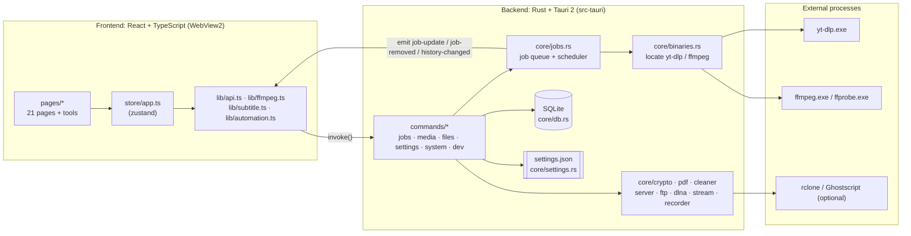
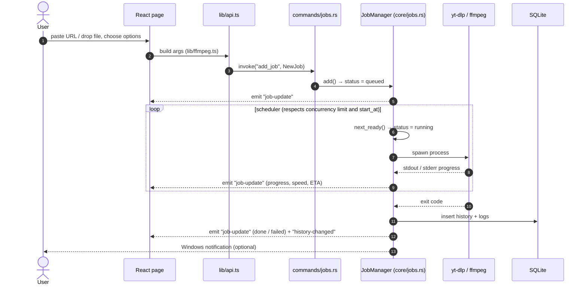
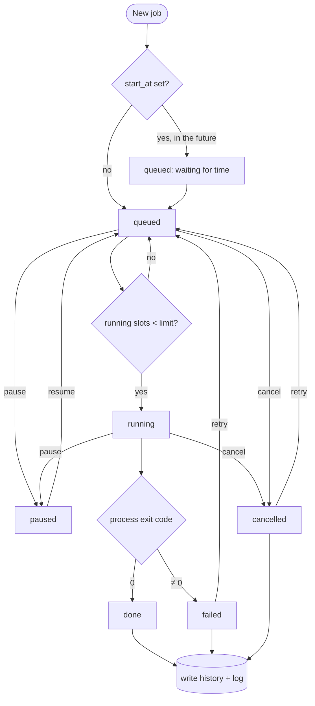
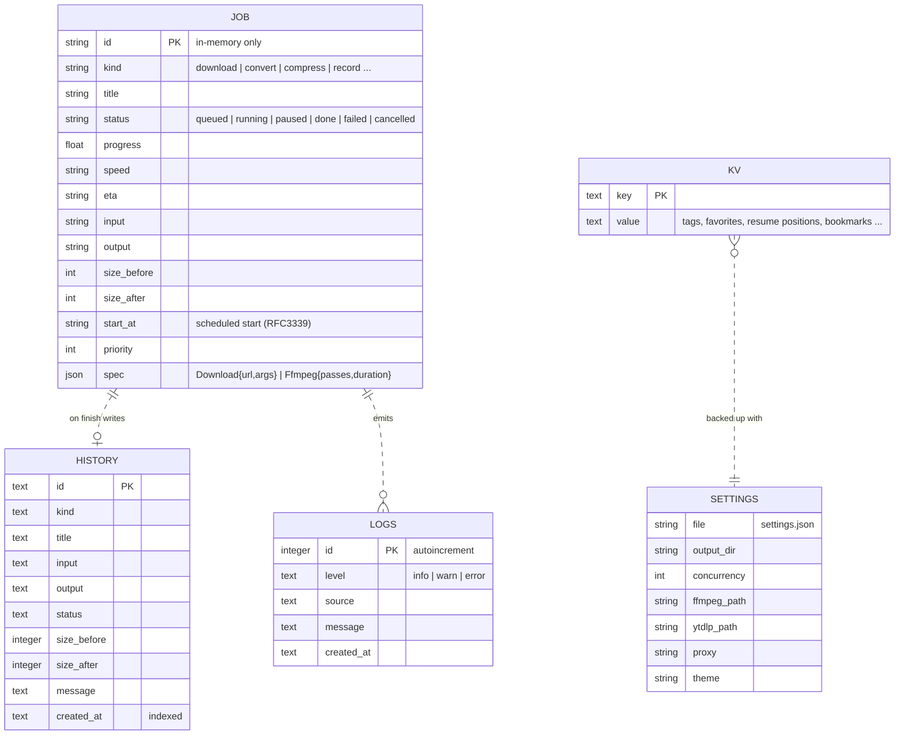

# MediaToolbox (มีเดียทูลบ็อกซ์)

An all-in-one media toolkit for Windows 10/11, built for Thai users. It can download videos, convert, compress, edit and play media, and it has 30+ small utilities, all in one offline desktop app.

> 🇹🇭 ภาษาไทย: [README.th.md](README.th.md)

- Built with **Rust + Tauri 2 + React + TypeScript + TailwindCSS**
- Thai UI throughout, with support for Thai file names and paths and Buddhist-era (พ.ศ.) dates
- Single user, no login, and it works offline (except for downloading and cloud upload)
- No AI and no paid APIs
- Ships with **yt-dlp** and **ffmpeg**, so there's nothing else to install
- Runs on x64 and ARM64

## Features (21 pages)

| Page | What it does |
|---|---|
| 🏠 Dashboard | Stats, live jobs, recent files, system charts, shortcuts, draggable widgets |
| 📥 Downloader | YouTube, Facebook (incl. groups), Instagram, TikTok (no watermark), X and 1000+ other sites. Queue with pause/resume, cookies, proxy, scheduling |
| 🔄 Converter | Video, audio and images. H.264/H.265/VP9/AV1/ProRes, NVENC/QSV/AMF. Trim, crop, rotate, speed, watermark, burn-in subtitles, ZIP export |
| 🗜️ Compressor | PDF (compress/split/merge/rotate/password/watermark), batch images, two-pass video, batch rename |
| ✂️ Editor | Video timeline with transitions, music, text, LUT, Ken Burns and chroma key. Audio EQ. Layered image editing |
| ▶️ Player | Playlists, SRT/VTT/ASS subtitles, resume, bookmarks, A-B loop, screenshots, PiP |
| ⚙️ Automation | Multi-step workflows, folder watchers, if-then rules, schedules, auto-sort |
| ☁️ Cloud Sync | rclone upload, LAN share with QR code, P2P transfer, built-in FTP server |
| 📊 Analytics | Usage stats, heatmap, storage treemap, duplicate/large files, empty folders, CSV/JSON export |
| 🗂️ Library | Gallery, filters, sorting, tags, favorites, slideshow |
| 🧰 Utilities | 30 tools: screen recorder, GIF, meme, QR/barcode, color, fonts, EXIF, hash, passwords, archives, subtitles, BPM, metronome, JSON/YAML, regex… |
| 📡 Streaming | Local media server, DLNA, podcast RSS feed, live stream and web radio recording |
| 🔒 Security | AES-256 encryption, secure delete, EXIF/GPS removal, watermark, PIN lock, auto-lock, panic button |
| 📱 Social | Reels, stories, profile pictures, thumbnails, hashtag counter, caption extraction, post planner |
| 🧑‍💻 Developer | API tester, API keys, webhooks, CLI, JS plugins, logs, cron |
| 🎉 Fun | Music player with visualizer and .lrc lyrics, voice commands, Pomodoro timer, a walking cat, Konami code, achievements |
| ❓ Help | Onboarding tour, tutorials, FAQ, shortcuts (`?`), changelog |
| 🖥️ System | CPU/RAM/GPU/disk/network, job queue, logs, backup and restore |
| 🎨 Personalize | Widgets, profile, notification sounds, hotkeys, language, custom themes |
| 🕘 History | Filter, search, open file or folder, CSV/JSON export |
| ⚙️ Settings | Output folder, cookies, concurrency, ffmpeg/yt-dlp paths, proxy, theme, language… |

## Architecture



## Data flow: a download or conversion job



## Job lifecycle



## Data model

MediaToolbox stores its data in SQLite at `%APPDATA%\th.mediatoolbox.app`. Active jobs live only in memory. When a job finishes, it's written to `history` and `logs`. The tables aren't linked by foreign keys. The dashed lines below show how rows relate logically.



## Project structure

```
src/                 React frontend
  components/        Layout, shared UI (buttons, cards, sliders, drag-sort …)
  hooks/             data hooks
  lib/               api (Rust bridge), ffmpeg (command builder), subtitle, format, automation, theme
  pages/             21 pages + tools/
  store/             zustand store
src-tauri/           Rust backend
  src/commands/      commands exposed to the frontend
  src/core/          jobs, db, crypto, pdf, server, ftp, dlna, stream, recorder, cleaner
  bin/               yt-dlp.exe, ffmpeg.exe, ffprobe.exe (fetched before build, not in git)
tests/               vitest unit tests + real ffmpeg integration tests
scripts/             fetch-binaries.ps1, build.ps1
```

Downloaded and converted files go to `Documents\MediaToolbox` by default.

## Development

Requirements: Node.js 20+, Rust (stable), Visual Studio Build Tools (C++), and WebView2 (built into Windows 11).

```bash
npm install
```

```bash
powershell -ExecutionPolicy Bypass -File scripts/fetch-binaries.ps1
```

```bash
npm run app:dev
```

`npm run dev` runs only the web UI in a browser, using mock data and no Rust backend.

### Tests

```bash
npm run typecheck
```

```bash
npm test
```

```bash
cd src-tauri && cargo test
```

If ffmpeg is on your `PATH`, `npm test` also runs real ffmpeg integration tests. Otherwise those tests are skipped.

## Build the installer

```bash
powershell -ExecutionPolicy Bypass -File scripts/build.ps1
```

The installers are written to `src-tauri/target/x86_64-pc-windows-msvc/release/bundle/` as `nsis/*.exe` and `msi/*.msi`. For ARM64, pass `-Target aarch64-pc-windows-msvc` after running `rustup target add aarch64-pc-windows-msvc`.

GitHub Actions (`.github/workflows/build.yml`) tests and builds x64 and ARM64 on every push. Pushing a `v*` tag also creates a draft release.

## Known limitations

- **rclone** (cloud sync) and **Ghostscript** (lossy PDF compression) must be installed separately. Without Ghostscript, PDFs are compressed losslessly instead.
- Voice commands use Windows Web Speech, which may need an internet connection.
- The social post planner only sets reminders. It doesn't post anything.
- LINE Notify shut down in 2025, so webhooks support Discord, Slack and generic URLs.
- Extracting 7z/RAR archives needs the `tar` that ships with Windows 10 1803 or later.
- Bundling ffmpeg makes the installer larger than 60 MB.
- Facebook and Instagram content that needs a login requires cookies in Settings. Close Chrome/Edge before downloading.

## License

MIT. yt-dlp (Unlicense) and ffmpeg (GPL/LGPL) remain under their own licenses.
Only download content you have the right to, and follow each site's terms of service.
